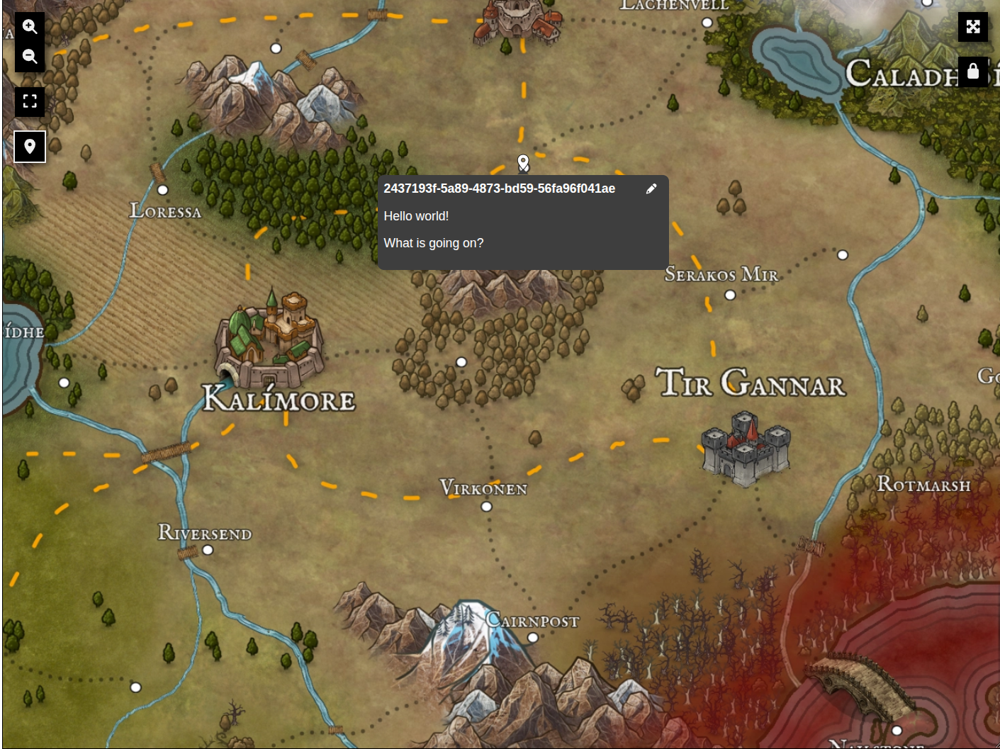

# Map Explorer
Map Explorer is a React library that can be used to display and interact with image-based maps.

## Usage
The principal exported component is `<MapExplorer />`, which must be a child of `<MapExplorerContextProvider />`. The basic usage is as follows:

```jsx
function MyApp() {
  return (<MapExplorerContextProvider>
    <MapExplorer image="/some-map.webp" resize="both" />
  <MapExplorerContextProvider />);
}
```

Inside `<MapExplorerContextProvider />`, the hook `useMapExplorer()` can be used to access map pins, camera location, and control these from outside the `<MapExplorer />` component.

## Preview
Here is what the component looks like:


